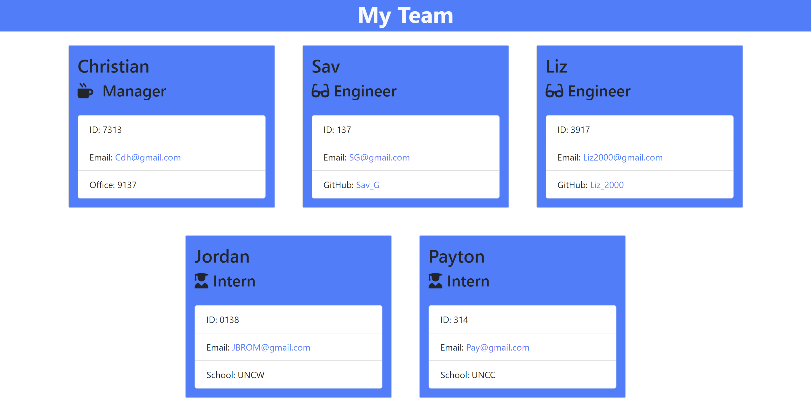

# Team Profile Generator

## Table on Contents

1. [Description](#description)
2. [Installation](#installation)
3. [Usage Information](#usage-information)
4. [Visuals](#visuals)

## Description
The team profile generator will allow you to generate a HTML page with your manager, engineers, and interns.\
You will see the name, job, employee ID, and email for all employees.\
Managers will show office number.\
Engineers will have a link to their Github.\
Interns will show where they went to school.

## Installation
Clone the repository/

## Usage Information
Run 'npm i' in your terminal to install all dependencies.\
Run node index.js in your terminal.\
Input all information and when your done your new page will be generated in an HTML file.

## Visuals
[Link to walkthrough video](https://drive.google.com/file/d/1XwWkCivNQ-tC0Von3lzdn6-6kZbuNZ77/view?usp=sharing)

